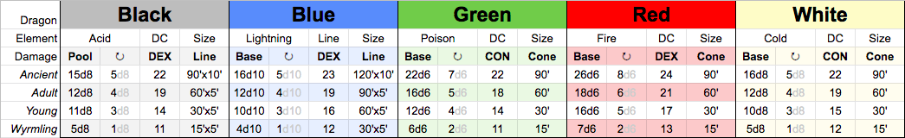

# DM Rules

## [Breath Weapon Dice Pool](https://thinkdm.org/2019/06/08/breath-weapon-dice-pool/)

The breath weapon’s damage dice become the breath weapon damage dice pool. You can spend any number of damage dice when making a breath weapon attack. You recharge a number of dice every turn equal to 1/3 of the total dice pool.

