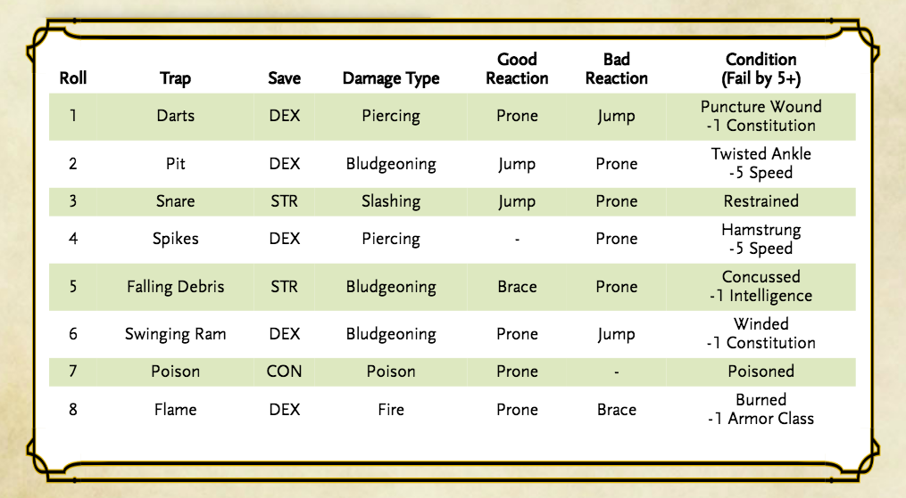

# Homerules

- Playable races that have a fly speed must use their concentration (as if they were casting a spell) to maintain flight beyond a single round

- If you end a turn whilst falling, and begin your next turn still falling, you must use your move to fall 500ft at the start of your turn. If you have a fly speed, or a reaction you may interrupt this fall by using half your move speed as though you were prone (XGE77)

- When measuring distance in 3D, count the horizontal distance and the vertical distance separately and use the larger of the two (rather than trying to calculate a hypotenuse)

- In order to preserve some of the adventure/exploration mechanics, the Goodberry spell requires and consumes the material component

- Feather Tokens (eg: Quaals Feather Token) are considered daily uses, rather than one-off consumables

- While in Heavy Obscurement and also in darkness, casting a spell against a target "you can see" is technically impossible. You may do so however if you a) have darkvision b) are standing beside the target of your spell, and c) can touch/sense/percieve them in some way

- Players may opt to use their reaction in combat to make ability checks that don't rely on them taking some physical activity. 
  - eg: When attempting to Counterspell effectively, the character with counterspell requires the assistance of another character to use their reaction to perform an Intelligence (Arcana) check to try and determine what spell is being cast
  - eg: When fighting against creatures that use the Hide action, a character may make a Wisdom (Perception) check as a Reaction to try and locate them

---

## Character Creation

Use whatever method you prefer for stats from any of the official sources (Point Buy, Std Array), or you may roll (4d6 drop lowest) 7 times (drop lowest) which creates powerful "hero" characters.

Use any WOTC published source books in any combinations.

---

## Variant Rules

### More Difficult Identification (DMG136)

Removes the ability to identify the properties of a magic item during a short rest, and requires the identify spell, experimentation, or both to reveal what a magic item does.

### Inspiration (PHB125)

#### Gaining Inspiration

Your DM can choose to give you inspiration for a variety of reasons. Typically. DMs award it when you play out your personality traits, give in to the drawbacks presented by a flaw or bond, and otherwise portray your character in a compelling way. Your DM will tell you how you can earn inspiration in the game.

You either have inspiration or you don't—you can't stockpile multiple "inspirations" for later use.

#### Using Inspiration

If you have inspiration, you can expend it when you make an attack roll, saving throw, or ability check. Spending your inspiration gives you advantage on that roll.

Additionally, if you have inspiration, you can reward another player for good roleplaying, clever thinking, or simply doing something exciting in the game. When another player character does something that really contributes to the story in a fun and interesting way, you can give up your inspiration to give that character inspiration.

(**Homerule addition:** A maximum number of inspiration tokens equal to `#PCs-1` are shared between the players and may be given by one PC to another for fulfilling the above critera)

### Cleaving Through Creatures (DMG272)

When a melee attack reduces an undamaged creature to 0 hit points, any excess damage from that attack might carry over to another creature nearby. The attacker targets another creature within reach and, if the original attack roll can hit it, applies any remaining damage to it. If that creature was undamaged and is likewise reduced to 0 hit points, repeat this process, carrying over the remaining damage until there are no valid targets, or until the damage carried over fails to reduce an undamaged creature to 0 hit points.

### Flanking (DMG251)

A creature can't flank an enemy that it can't see. A creature also can't flank while it is incapacitated. A Large or larger creature is flanking as long as at least one square or hex of its space qualifies for flanking.

When a creature and at least one of its allies are adjacent to an enemy and on opposite sides or corners of the enemy's space, they flank that enemy, and each of them has advantage on melee attack rolls against that enemy.

(**Homerule addition:** When in doubt about whether two creatures flank an enemy on a grid, use +2 to hit instead)

### Simultaneous Effects (XGE77)

Most effects in the game happen in succession, following an order set by the rules or the DM. In rare cases, effects can happen at the same time, especially at the start or end of a creature's turn. If two or more things happen at the same time on a character or monster's turn, the person at the game table—whether player or DM—who controls that creature decides the order in which those things happen. For example, if two effects occur at the end of a player character's turn, the player decides which of the two effects happens first.

### Encumbrance (PHB176)

> Note: The encumbrance rule is imposed for narrative purposes only. No mechanical penalties will be applied outside of those the player wishes to role-play

If you carry weight in excess of 5 times your **Strength** score, you are encumbered, which means your speed drops by 10 feet.

If you carry weight in excess of 10 times your **Strength** score, up to your maximum carrying capacity, you are instead heavily encumbered, which means your speed drops by 20 feet and you have disadvantage on ability checks, attack rolls, and saving throws that use **Strength**, **Dexterity**, or **Constitution**.

---

## Action Options

### Trap *Click* 3-2-1 ([1](https://theangrygm.com/traps-suck/), [2](https://thinkdm.org/2019/06/22/simple-trap-system/))

When the characters encounter a trap, the DM declares "CLICK!" Going around the table, the players have the opportunity to say how their character reacts (**brace**, **jump** or **prone**).

<!--
  Image Reference:
    
-->

### Hold Turn/Initiative

In previous editions there was a mechanic which allowed you to "hold initiative" so that you could go later in the round. This mechanic does not exist in 5e, and is replaced by the Ready Action.

### Ready Action (PHB193)

> Included for clarity alongside Hold Turn/Initiative

Sometimes you want to get the jump on a foe or wait for a particular circumstance before you act. To do so, you can take the Ready action on your turn, which lets you act using your reaction before the start of your next turn.

First, you decide what perceivable circumstance will trigger your reaction. Then, you choose the action you will take in response to that trigger, or you choose to move up to your speed in response to it. Examples include "If the cultist steps on the trapdoor, I'll pull the lever that opens it," and "If the goblin steps next to me, I move away."

When the trigger occurs, you can either take your reaction right after the trigger finishes or ignore the trigger. Remember that you can take only one reaction per round.

When you ready a spell, you cast it as normal but hold its energy, which you release with your reaction when the trigger occurs. To be readied, a spell must have a casting time of 1 action, and holding onto the spell's magic requires concentration. If your concentration is broken, the spell dissipates without taking effect. For example, if you are concentrating on the web spell and ready magic missile, your web spell ends, and if you take damage before you release magic missile with your reaction, your concentration might be broken.

### Climb onto a Bigger Creature (DMG271)

If one creature wants to jump onto another creature, it can do so by grappling. A small or Medium creature has little chance of making a successful grapple against a Huge or Gargantuan creature, however, unless magic has granted the grappler supernatural might.

As an alternative, a suitably large opponent can be treated as terrain for the purpose of jumping onto its back or clinging to a limb. After making any ability checks necessary to get into position and onto the larger creature, the smaller creature uses its action to make a **Strength (Athletics)** or **Dexterity (Acrobatics)** check contested by the target's **Dexterity (Acrobatics)** check. If it wins the contest, the smaller creature successfully moves into the target creature's space, the smaller creature moves with the target and has advantage on attack rolls against it.

The smaller creature can move around within the larger creature's space, treating the space as difficult terrain. The larger creature's ability to attack the smaller creature depends on the smaller creature's location, and is left to your discretion. The larger creature can dislodge the smaller creature as an action—knocking it off, scraping it against a wall, or grabbing and throwing it—by making a **Strength (Athletics)** check contested by the smaller creature's **Strength (Athletics)** or **Dexterity (Acrobatics)** check. The smaller creature chooses which ability to use.

### Disarm (DMG271)

A creature can use a weapon attack to knock a weapon or another item from a target's grasp. The attacker makes an attack roll contested by the target's **Strength (Athletics)** check or **Dexterity (Acrobatics)** check. If the attacker wins the contest, the attack causes no damage or other ill effect, but the defender drops the item.

The attacker has disadvantage on its attack roll if the target is holding the item with two or more hands. The target has advantage on its ability check if it is larger than the attacking creature, or disadvantage if it is smaller.

### Overrun (DMG271)

When a creature tries to move through a hostile creature's space, the mover can try to force its way through by overrunning the hostile creature. As an action or a bonus action, the mover makes a **Strength (Athletics)** check contested by the hostile creature's **Strength (Athletics)** check. The creature attempting the overrun has advantage on this check if it is larger than the hostile creature, or disadvantage if it is smaller. If the mover wins the contest, it can move through the hostile creature's space once this turn.

(**Homerule addition:** without invoking an attack of opportunity)

### Tumble (DMG271)

A creature can try to tumble through a hostile creature's space, ducking and weaving past the opponent. As an action or a bonus action, the tumbler makes a **Dexterity (Acrobatics)** check contested by the hostile creature's **Dexterity (Acrobatics)** check. If the tumbler wins the contest, it can move through the hostile creature's space once this turn.

(**Homerule addition:** without invoking an attack of opportunity)

### Shove Aside (DMG271)

With this option, a creature uses the special shove attack from the Player's Handbook to force a target to the side, rather than away. The attacker has disadvantage on its **Strength (Athletics)** check when it does so. If that check is successful, the attacker moves the target 5 feet to a different space within its reach.

### Shoving a Creature

> Included for clarity alongside Shove Aside

Using the Attack action, you can make a Special melee Attack to shove a creature, either to knock it prone or push it away from you. If you’re able to make multiple attacks with the Attack action, this Attack replaces one of them.
The target must be no more than one size larger than you and must be within your reach. Instead of Making an Attack roll, you make a **Strength (Athletics)** check contested by the target’s **Strength (Athletics)** or **Dexterity (Acrobatics)** check (the target chooses the ability to use). If you win the contest, you either knock the target prone or push it 5 feet away from you.

### Temporary HP can be Useful

If while maintaining concentration a character takes damage that would require a concentration check, if that damage would be dealt entirely to Temporary HP no concentration check is required.

### Pushing the limits

This homerule aims to add a 'cinematic' element, allowing a character to push themselves when they have nothing left to give. As a free action the character restores some depleted resource to be used **immediately** in exchange for a number of levels of exhaustion. The exhaustion takes effect when the 'cinematic' action is completed

Examples:

- Spellcaster: Regenerate a level _N_ spell slot in exchange for _N+1_ levels of exhaustion when the spell ends
- Druid: Wild shape into a CR _N_ beast in exchange for _N+1_ levels of exhaustion when the wild shape ends
- Fighter: Take an additional Attack Action, in exchange for a number of exhaustion levels equal to the number of attacks made as part of the Attack Action (minimum 1)

Other actions may be taken, consult your DM for specifics.

### Lycanthropy 

**TBC**

## Underwater Combat

### Breathing

- Creatures can hold their **breath** for a number of rounds equal to their CON score before begining to drown
- A drowning creature can survive for CONMOD rounds and cannot take Actions or Reactions, after which they become unconsious and cannot be stabilized or regain hp until they can breathe

### Movement

- Creatures without a natural swim speed must make "Swim" (Athletics or Strength) checks at the start of each turn (Calm water DC10, Flowing water DC15, White water/Rapids DC20)
  - Success means the creature can move at 1/2 their normal move speed
  - Failure means the creature can not willingly move this round, takes -DEXMOD to AC and has DISADV on Dex Checks and Saves until a successful swim check is made
  - Extreme failure results in an uncontrolled buoyancy movement (usually sinking) of 5ft per 5 under the Swim DC

### Visibility

- The maximum perception range underwater is determined by the clarity of the water (eg Clear 100ft, Murky 30ft) and the depth (Dim light at [Clarity * 6]ft and Darkness at [Clarity * 10]ft)

### Weapons and Attacks

- Weapons that deal **B**ludgeoning or **S**lashing damage have -2 to hit and do 1/2 damage
- Ranged weapons take a penalty of -2 to hit per 5 feet, and all listed missile ranges are halved
- Thrown weapons do not function underwater unless they are Darts, Javelins, Spears, Tridents or Nets

### Spellcasting

- Casting a spell underwater that requires a **V**erbal component reduces **breath** by 1
- A creature holding their breath and concentrating on a spell must make a concentration check at the start of each turn with a starting DC of 10, increasing by 1 per turn spent concentrating underwater

### Sources

- [GM Tips 164 Underwater Campaign Considerations with environments effects swim and others](https://www.youtube.com/watch?v=9xowjh4QcPU)
- [Has anyone tried an underwater combat? What was it like?](https://www.reddit.com/r/DnD/comments/2xsjqt/has_anyone_tried_an_underwater_combat_what_was_it/)